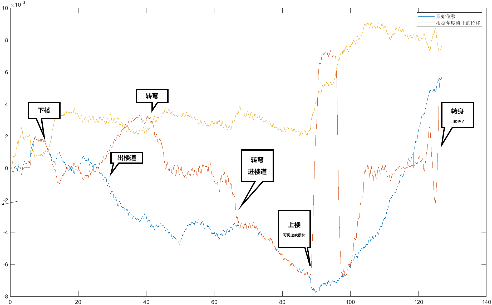

# 实验目的

大多数 Android 设备都有内置传感器，用来测量运动、屏幕方向和各种环境条件。这些传感器能够提供高度精确的原始数据，非常适合用来监测设备的三维移动或定位，或监测设备周围环境的变化。市场中也有成型的软件将这些传感器的数据导出但大都由国外团队开发且未开源，本实验开发了一款基于开源项目Autox.js的安卓设备传感器数据记录软件，可以供在arm64-v8a，armeabi-v7a，x86，x86_64等设备平台下运行。

# 实验器材

## 开发环境

IDE：vscode（主要使用插件https://marketplace.visualstudio.com/items?itemName=aaroncheng.auto-js-vsce-fixed）

ADB版本：Android Debug Bridge version 1.0.41Version 28.0.2-debian

系统：Ubuntu 22.04.2 LTS

## 编译环境

编译设备：Google Pixel 6，Android 13

编译软件：Autox.js（https://github.com/kkevsekk1/AutoX/compare/6.3.7...6.3.7）

## 技术栈

ES6，[Rhino 1.7.13](https://github.com/mozilla/rhino)，auto.js，autox.js

# 实验原理及内容

1.   通过调用autox.js提供的api调用android提供的传感器api注册传感器对象，同时检查传感器是否可用

2.   监听传感器参数改变的事件，在事件响应时将值存入临时变量
3.   基于javascript的eventLoop机制，使用serInterval函数在指定时间间隔内将临时变量的值组合符合csv文件标准的字符串，存入文件输入流中

# 主要实验步骤

1.   编写程序，编译安装包
2.   在手机上安装软件
3.   设计实验测试软件性能
4.   进行实验，得出数据
5.   分析结果

# 实验数据

代码：

>   这个项目比较小所以使用单个.js文件包含代码和布局部分，样式全用默认

```javascript
"ui";
ui.layout(
    <vertical w="*" h="*">
        <text textSize="40sp" textStyle="bold" textColor="#000000">Sensorself</text>
        <text textColor="#000000">你的下一款传感器又何必是传感器</text>
        <text> </text>
        <text margin="10 0">注意！距离传感器只有两个值：0/5，0表示前置摄像头附近有物体，5表示反之情况</text>
        <text margin="10 0">注意！大部分设备没有环境温度和环境湿度传感器</text>
        <text> </text>
        <text textColor="#000000">经检测,您的设备缺失以下传感器</text>
        <list id="mistake_sensor_list_display">
            <horizontal>
                <text h="20sp" textColor="#000000" id="context" text="{{context}}"></text>
            </horizontal>
        </list>
        <text> </text>
        <button w="*" id="no_shutdown" style="Widget.AppCompat.Button.Colored" text="开始记录" />
        <button w="*" id="shutdown" style="Widget.AppCompat.Button.Colored" text="结束记录" />
        <text> </text>
        <text textSize="20sp" textColor="#000000">数据文件存放路径</text>
        <input inputType="textLongMessage" w="*" id="path" text="/storage/emulated/0/Documents/data.csv" />
        <button w="*" id="path_change" text="确定" />
        <text> </text>
        <text textSize="20sp" textColor="#000000">数据记录间隔</text>
        <text>不建议改太小,可能会影响时间帧记录,简单观测下来,实际使用过程中可能会有11ms左右的误差</text>
        <input inputType="number" w="*" id="interval_time_input" text="500" />
        <button w="*" id="interval_time_change" text="确定" />
        <text> </text>
        <text>本软件用于提交物理创新实验作业, 大概率不会有后续版本, 点击下方按钮跳转项目地址</text>
        <button w="*" id="turn_github" text="跳转" />
    </vertical >
);

const key = ["accelerometer", "orientation", "gyroscope", "magnetic_field", "gravity", "linear_acceleration", "ambient_temperature", "light", "pressure", "proximity", "relative_humidity"], sensor_des = ["加速度传感器", "方向传感器", "陀螺仪传感器", "磁场传感器", "重力传感器", "线性加速度传感器", "环境温度传感器", "光线传感器", "压力传感器", "距离传感器", "湿度传感器"], sensor_arg = ["x轴加速度m/s^2,y轴加速度m/s^2,z轴加速度m/s^2,", "方位角/度,绕x轴旋转的角度/度,绕y轴顺时针旋转的角度/度,", "x轴角速度P/rad/s,y轴角速度/rad/s,z轴角速度/rad/s,", "x轴磁场强度/uT,y轴磁场强度/uT,z轴磁场强度/uT,", "x轴重力加速度m/s^2,y轴重力加速度m/s^2,z轴重力加速度m/s^2,", "x轴线性加速度m/s^2,y轴线性加速度m/s^2,z轴线性加速度m/s^2,", "环境温度/摄氏度,", "环境光强度/lux,", "大气压/hPa,", "0/5,", "相对湿度/%,"];

var sensor_arr = [];
let mistake_sensor = new Set(), mistake_msg = "", csv_path = "/storage/emulated/0/Documents/data.csv", interval_time = 500;
var csv_temp_msg = [""];
key.forEach((element, index) => {
    sensor_arr.push(sensors.register(element, sensors.delay.game));
    if (!sensor_arr[index]) mistake_sensor.add(index);
});

toastLog(mistake_sensor);

var mistake_sensor_list = [];
mistake_sensor.forEach(element => {
    mistake_sensor_list.push({
        "context": `➰${sensor_des[element]}不可用\n`
    });
});

ui.mistake_sensor_list_display.setDataSource(mistake_sensor_list);

const begin_scanf = function () {
    sensor_arr.forEach((element, index) => {
        element ? element.on("change", (event, a, b, c) => {
            csv_temp_msg[index] = "";
            if (!(a === NaN)) csv_temp_msg[index] += util.format("%d,", a) || util.format("0,");
            if (b) csv_temp_msg[index] += util.format("%d,", b);
            if (c) csv_temp_msg[index] += util.format("%d,", c);
        }) : "";
    });
}

var file = open(csv_path, "w");
begin_scanf();

const begin_write_data = function (interval_time) {
    let csv_heard = "时间,";
    toastLog("开始记录数据 " + new Date());
    var now = Date.now();
    sensor_arg.forEach((element, index) => {
        if (!mistake_sensor.has(index)) csv_heard += element;
    });
    file.writeline(csv_heard);
    return setInterval(() => {
        let msg = (Date.now() - now) + ",";
        for (let index in csv_temp_msg)
            if (!mistake_sensor.has(index))
                msg += csv_temp_msg[index];
        file.writeline(msg);
        console.log("写入数据\n" + csv_temp_msg);
    }, interval_time);
}

var writer;

ui.no_shutdown.click(() => {
    begin_scanf();
    file = open(csv_path, "w");
    writer = begin_write_data(interval_time);
});
ui.shutdown.click(() => {
    clearInterval(writer);
    file.close();
    sensors.unregisterAll();
});
ui.path_change.click(() => {
    csv_path = ui.path.getText();
    console.log(csv_path);
});
ui.interval_time_change.click(() => {
    interval_time = ui.interval_time_input.getText();
    console.log(interval_time);
});
ui.turn_github.click(() => app.openUrl("https://github.com/nan-mu/sensorself"));
```

测试实验：将手机平移和旋转，分析角加速度，线性方向加速度，重力加速度得出运动路径，计算总位移是否为0

>   本来我想把实验过程录下来，但最终设计的路径是从宿舍楼走一圈，过程比较长，就不录了

# 数据处理及实验结果

由于测出的物理量大都是加速度，已知初速度为0，所以可以直接把 $dt$ 带成$\Delta t$然后硬算算出速度，然后得出位移，旋转角度； 
$$
a = \frac{dv}{dt} = \frac{\Delta v}{\Delta t}\\
x = \sum \Delta v \Delta t = \sum a\Delta t^2
$$
而手机的正方向是固定的，也就是说人握着手机旋转，手机传感器测量的角度会改变但加速度的方向不会改变，也就是说我们需要根据角度修正加速度的值。

在实验过程中，我手持手机在宿舍绕一圈，记录频率选10ms，手机x方向始终为移动方向且相对身体保持不动。

计算数据取加速度传感器的x方向加速度和方向传感器的方位角，总的代码如下

```matlab
% 整理时间间隔矩阵
deT = ([data.time; 0] - [0; data.time])./1000.^2;
time = data.time./1000;
deT(end,:) = [];

% 设备坐标系位移
total_x = sum(abs(data.xms2).*deT);
x = cumsum(data.xms2.*deT);

% 角度修正坐标系位移
x_fix = x.*(cos((data.xAng./180).*pi));

plot(time, x, time, x_fix, time, -cumsum(data.xms3.*deT));
d=legend("原始位移","根据角度修正的位移");
```



由上图结合实验路径可发现，传感器在运动幅度过大，比如转身时表现相当差，具体分析见误差分析。

##  存在的问题和误差来源分析

* 我先前在宿舍内进行了多次测试，结果来看数据相当不好，我认为需要适当提升数据记录的频率，在这一版软件中我写的是能有多少传感器就记录多少数据，这样相当耗费设备资源，假如后续开发应该让用户自主选择需要保存哪些数据。

* 我最开始设计的csv文件表头其实不利于导入matlab进行数据处理，还是应该用全英文。

* 让人拿着手机移动感觉并不太好，应该设计一个小车，在确定长度的场地拖着手机移动，这样得出来的数据会更加精准，但这种小车并不算随处可见的实验器材。
* 有一个问题我在阅读Android开发文档后也没有得到准确的答案，为什么加速度传感器会有负值？方向不应该只由方向传感器表达吗？
* 从图像分析，在微小尺度内，原始位移的图像和修正位移的图像并不重合，这也是因为人手持手机的问题，在y轴方向和z轴方向上手机角度并不为0，这会导致部分加速度被分在其他两个方向上了。